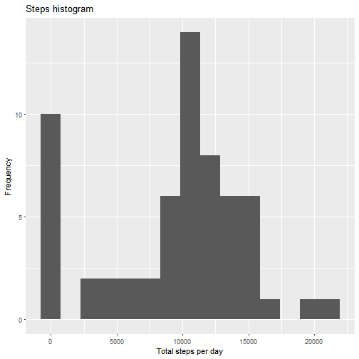
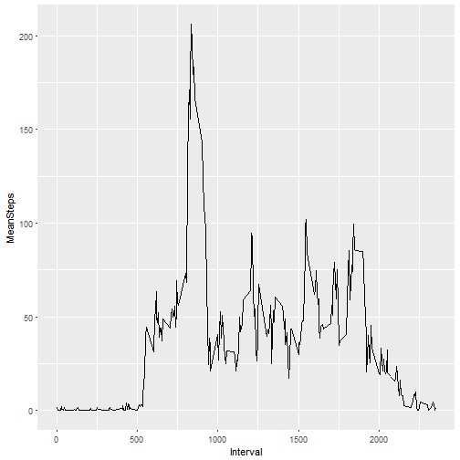
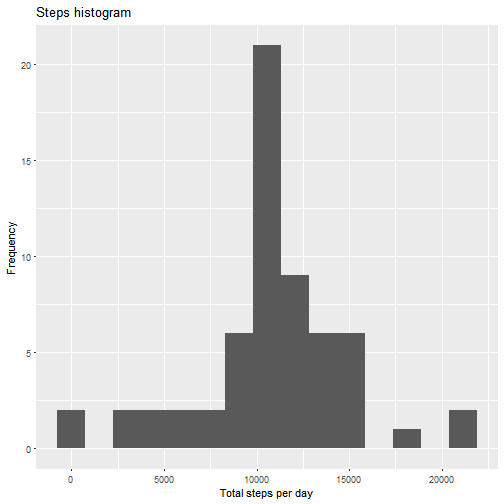
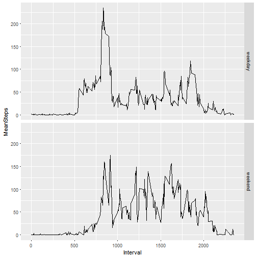

Project 1
=========

## Setup

Loading necessary packages to start the work.

```r
library(ggplot2)
library(dplyr)
library(lubridate)
setwd("C:\\Users\\barca\\Desktop\\DATA SCIENCE\\Reproducible Research week 2") # Change to your WD if necessary. 
```

Loading and doing some transformations with data.


```r
stepsData <- tbl_df(read.csv("activity.csv", header = T, na.strings = "NA", col.names = c("Steps", "Date", "Interval")))
stepsData$Date <- ymd(stepsData$Date)
```
## Part 1 - Total steps
Calculating total number of steps by days and building a histogram using ggplot2 package.


```r
sums <- sapply(split(stepsData$Steps, stepsData$Date), sum, na.rm = TRUE)
ggplot(as.data.frame(sums), aes(sums)) + labs(title = "Steps histogram", x = "Total steps per day", y = "Frequency") + geom_histogram(bins = 15)
```



Calculating mean and median for total steps taken per day. 

```r
data.frame(mean = mean(sums), median = median(sums))
```

```
##      mean median
## 1 9354.23  10395
```


## Part 2 - Time Series plot
Now we will construct a time-series plot with 5 minutes interval. Before that, we will use the group_by dplyr function to find the means of the 5-minute intervals.


```r
stepsbyints <- group_by(stepsData, Interval)
stepsint <- summarize(stepsbyints, MeanSteps = mean(Steps, na.rm = T))
ggplot(stepsint, aes(Interval, MeanSteps)) + geom_line()
```




## Part 3 - Missing Values
Now we will work to substitute missing values from *stepsData*.

Number of NA rows:

```r
nrow(stepsData[is.na(stepsData$Steps),])
```

```
## [1] 2304
```
Substituting NA values with interval means:

```r
stepsbyints2 <- group_by(stepsData, Interval)
stepsint2 <- mutate(stepsbyints2, MeanSteps = mean(Steps, na.rm = T))
stepsData2 <- stepsData
for (i in 1:length(stepsData$Interval)) {
    if (is.na(stepsData$Steps[i] == TRUE))    {
          stepsData2$Steps[[i]] = stepsint2$MeanSteps[[i]] }
                                        }
```

Calculating the mean and median of new *stepsData2* compared to old stepsData dataset.

New mean and median:

```r
sumsnew <- (sapply(split(stepsData2$Steps, stepsData2$Date), sum))
newmm <- c(mean(sumsnew), median(sumsnew))
newmm
```

```
## [1] 10766.19 10766.19
```
Old mean and median:

```r
sumsold <- sapply(split(stepsData$Steps, stepsData$Date), sum, na.rm = TRUE)
oldmm <- c(mean(sumsold), median(sumsold))
oldmm
```

```
## [1]  9354.23 10395.00
```

Let's make a new histogram with NA values substituted. 

```r
ggplot(as.data.frame(sumsnew), aes(sumsnew)) + labs(title = "Steps histogram", x = "Total steps per day", y = "Frequency") + geom_histogram(bins = 15)
```



As we can see, the values of the mean and median increase after substitution. However, the histogram didn't change dramatically after te NA manipulation.

## Part 4 - Weekdays/Weekends

Adding factor variable, which will differ weekdays from weekends.


```r
stepsData <- mutate(stepsData, Weekday = weekdays(Date))

for(i in 1:length(stepsData$Steps)) {
 if(stepsData$Weekday[i] == "ñóááîòà") {stepsData$Weekday[i] = "weekend"
   }else if (stepsData$Weekday[i] == "âîñêðåñåíüå") {stepsData$Weekday[i]                                                      = "weekend"
         }else {stepsData$Weekday[i] = "weekday"}
                                    }
        
stepsData$Weekday <- as.factor(stepsData$Weekday)
summary(stepsData$Weekday)
```

```
## weekday weekend 
##   12960    4608
```

Now let's plot time series for weekdays and weekends.

```r
stepsDataF <- group_by(stepsData, Weekday, Interval)
stepsDataF <- mutate(stepsDataF, MeanSteps = mean(Steps, na.rm = T))
ggplot(stepsDataF, aes(Interval, MeanSteps)) + geom_line() + facet_grid( stepsDataF$Weekday ~.)
```




